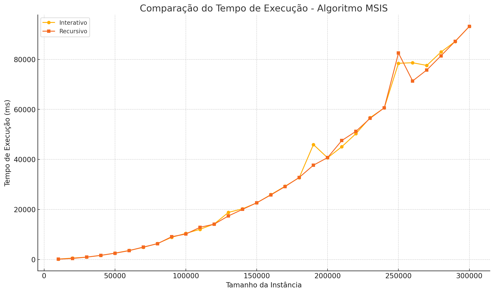

# Trabalho de Programação Dinâmica: 
* Aluno: Jean Carlo Alves Ferreira
* Docente: Marcia Aparecida Fernandes

## Maximum Sum Increasing Subsequence (MSIS)
*Problema Selecionado: Máxima Subsequência Crescente*

O problema de MSIS deve encontrar uma subsequência de uma dada sequência de números de tal forma que os elementos da subsequência estão em ordem crescente e a soma da subsequência é maximizada. Este problema pode ser efetivamente resolvido usando programação dinâmica.

### Relação de Recorrência
Seja MSIS(i) a soma máxima de uma subsequência crescente que termina com o i sendo o ésimo elemento.

MSIS(i) = max(MSIS(j) +arr[i])   for all j <i and arr[j]
onde arr é a matriz dada de números.

**Objetivo**: Dado um array de inteiros, então devo encontrar a subsequência crescente com a soma máxima.

### Exemplo

- **Entrada**: [1, 101, 3, 2, 100, 4, 5]
- **Saída**: 106 (subsequência crescente: [1, 3, 100])

## Algoritmo em Pseudo-código

1. Inicialize um array `MSIS` onde `MSIS[i]` representará a soma máxima de uma subsequência crescente que termina no elemento `arr[i]`.
2. Inicialize `MSIS[i]` com `arr[i]` para todos os `i`, pois a soma mínima possível é o próprio elemento.
3. Para cada elemento `arr[i]`, percorra todos os elementos `arr[j]` antes de `i`.
   - Se `arr[i]` for maior que `arr[j]`, atualize `MSIS[i]` com `MSIS[i] = max(MSIS[i], MSIS[j] + arr[i])`.
4. A resposta final será o maior valor no array `MSIS`.

```pseudo
function subSequenciaCrescenteSomaMaxima(arr):
    n = length(arr)
    if n == 0:
        return 0

    MSIS = array of size n
    for i = 0 to n-1:
        MSIS[i] = arr[i]
        
    for i = 1 to n-1:
        for j = 0 to i-1:
            if arr[i] > arr[j]:
                MSIS[i] = max(MSIS[i], MSIS[j] + arr[i])
                
    max_sum = MSIS[0]
    for i = 1 to n-1:
        if MSIS[i] > max_sum:
            max_sum = MSIS[i]
            
    return max_sum
```

## Implementação em Java

```java
public class SubSequenciaCrescenteSomaMaxima {
    static int maiorSomaE(int arr[]) {
        int n = arr.length;
        if (n==0){
            return 0;
        }
        //Array Entrada: [1, 101, 3, 2, 100, 4, 5]

        int MSIS[] = new int[n];
        for (int i = 0; i < n; i++) {
            MSIS[i] = arr[i];
        }
        //Saída de MIS: [1, 101, 3, 2, 100, 4, 5]

        for (int i = 1; i < n; i++) {
            for (int j = 0; j < i; j++) {
                if (arr[i] > arr[j] && MSIS[i] < MSIS[j] + arr[i]) {
                    MSIS[i] = MSIS[j] + arr[i];
                }
            }
        }
        //Saída de MIS: [1, 102, 4, 3, 104, 8, 13]

        int max = MSIS[0];
        for (int i = 1; i < n; i++) {
            if (MSIS[i] > max) {
                max = MSIS[i];
            }
        }
        // Saída de Max é 104
        return max;
    }

    public static void main(String[] args) {
        int arr[] = {1, 101, 3, 2, 100, 4, 5};
        System.out.println("A soma máxima da subsequência crescente é " + maiorSomaE(arr));
    }
}
```

## Análise da Complexidade de Tempo

A complexidade de tempo do algoritmo acima é \(O(n^2)\). Isso ocorre porque temos dois loops aninhados: o loop externo percorre todos os elementos do array (\(n\)) e o loop interno percorre todos os elementos anteriores a cada elemento (\(n\)).

## Razões para a Seleção:

* Algoritmo Claro e Intuitivo: está abordagem de subsequência crescente com a soma máxima é direta e fácil de entender.
* Código simplificado:  o código é legível e não requer estrutura de dados complexa, facilitou na compreensão.

* Relevância: A subsequência crescente com a soma máxima é um problema prático com aplicações em várias áreas, como análise de séries temporais, bioinformática e finanças.

* Complexidade de tempo razoável igual a \(O(n^2)\): 
Embora não seja a mais eficiente possível, a complexidade de tempo \(O(n^2)\) é aceitável para muitos casos práticos, e o algoritmo é eficiente para tamanhos de entrada moderados onde a complexidade de espaço sendo \(O(n)\). A abordagem é significativamente mais eficiente do que uma solução de força bruta, que teria uma complexidade exponencial.

* Base Teórica Sólida: A solução demonstra de forma clara os princípios de programação dinâmica, incluindo definição de subproblemas.


# Técnica de Algoritmo Interativo da Programação Dinâmica.
Este algoritmo itera sobre a matriz de entrada 'arr', mantendo um array 'MSIS' que armazena a soma máxima de uma subsequência crescente que termina no elemento atual. Ele também mantém um array 'posicoes' para armazenar as posições dos elementos na subsequência. No final, ele encontra o máximo valor em 'MSIS' e reconstrói a subsequência correspondente.

```pseudo
def subSequenciaCrescenteSomaMaxima(arr):
    n = len(arr)
    if n == 0:
        return 0, []

    MSIS = [0] * n
    MSIS[0] = arr[0]
    posicoes = [0] * n

    for i in range(1, n):
        for j in range(i):
            if arr[i] > arr[j] and MSIS[i] < MSIS[j] + arr[i]:
                MSIS[i] = MSIS[j] + arr[i]
                posicoes[i] = j

    max_sum = max(MSIS)
    max_index = MSIS.index(max_sum)
    subsequence = [arr[max_index]]

    while max_index != posicoes[max_index]:
        max_index = posicoes[max_index]
        subsequence.append(arr[max_index])

    subsequence.reverse()

    return max_sum, subsequence
```

# Técnica de Algoritmo Recursisvo (sem memorização).
Este algoritmo recursivo calcula a soma máxima e a subsequência correspondente para uma determinada posição i. Ele itera sobre todas as posições anteriores j e verifica se o elemento atual pode ser adicionado à subsequência. No entanto, como não há memorização, ele recalcula as mesmas subproblemas várias vezes, o que pode resultar em um desempenho pior em comparação com a abordagem iterativa ou recursiva com memorização.

```pseudo
def subSequenciaCrescenteSomaMaxima(arr, i):
    if i == 0:
        return arr[0], [arr[0]]

    max_sum = arr[i]
    max_subsequence = [arr[i]]

    for j in range(i):
        prev_sum, prev_subsequence = subSequenciaCrescenteSomaMaxima(arr, j)
        if arr[i] > arr[j] and max_sum < prev_sum + arr[i]:
            max_sum = prev_sum + arr[i]
            max_subsequence = prev_subsequence + [arr[i]]

    return max_sum, max_subsequence
```

### Comparativo da Execução na Análise de Algoritmo da Máxima Subsequência Crescente (MSIS) 

A análise compara os tempos de execução dos algoritmos interativo e recursivo para diferentes tamanhos de instância.

#### Tabela de Comparação dos Resultados

| Tamanho da Instância | Tempo de Execução Interativo (ms) | Tempo de Execução Recursivo (ms) |
|----------------------|-----------------------------------|----------------------------------|
| 10000                | 155                               | 113                              |
| 20000                | 542                               | 402                              |
| 30000                | 925                               | 926                              |
| 40000                | 1624                              | 1646                             |
| 50000                | 2531                              | 2494                             |
| 60000                | 3586                              | 3519                             |
| 70000                | 4852                              | 4950                             |
| 80000                | 6369                              | 6299                             |
| 90000                | 8859                              | 9104                             |
| 100000               | 10423                             | 10152                            |
| 110000               | 12049                             | 12855                            |
| 120000               | 14184                             | 14112                            |
| 130000               | 18811                             | 17388                            |
| 140000               | 20252                             | 20028                            |
| 150000               | 22620                             | 22654                            |
| 160000               | 25929                             | 25809                            |
| 170000               | 29268                             | 29143                            |
| 180000               | 32723                             | 32801                            |
| 190000               | 45933                             | 37685                            |
| 200000               | 40644                             | 40723                            |
| 210000               | 45063                             | 47537                            |
| 220000               | 50286                             | 51231                            |
| 230000               | 56686                             | 56426                            |
| 240000               | 60583                             | 60630                            |
| 250000               | 78440                             | 82524                            |
| 260000               | 78658                             | 71376                            |
| 270000               | 77580                             | 75767                            |
| 280000               | 82935                             | 81426                            |
| 290000               | 87147                             | 87225                            |
| 300000               | 93176                             | 93169                            |

#### 

## Referências para Seleção do Problema:

1. [Maximum Sum Decreasing Subsequence](https://iq.opengenus.org/maximum-sum-decreasing-subsequence/)
2. [Maximum Sum Increasing Subsequence](https://iq.opengenus.org/maximum-sum-increasing-subsequence/)
3. [Dynamic Programming: Techniques for Solving Optimization Problems/](https://ifacet.iitk.ac.in/knowledge-hub/data-structure-with-c/dynamic-programming-techniques-for-solving-optimization-problems/)
4. [Maximum Sum Increasing Subsequence - Grokking Dynamic Programming: A Deep Dive Using Java](https://www.educative.io/courses/grokking-dynamic-programming-a-deep-dive-using-java/maximum-sum-increasing-subsequence)
